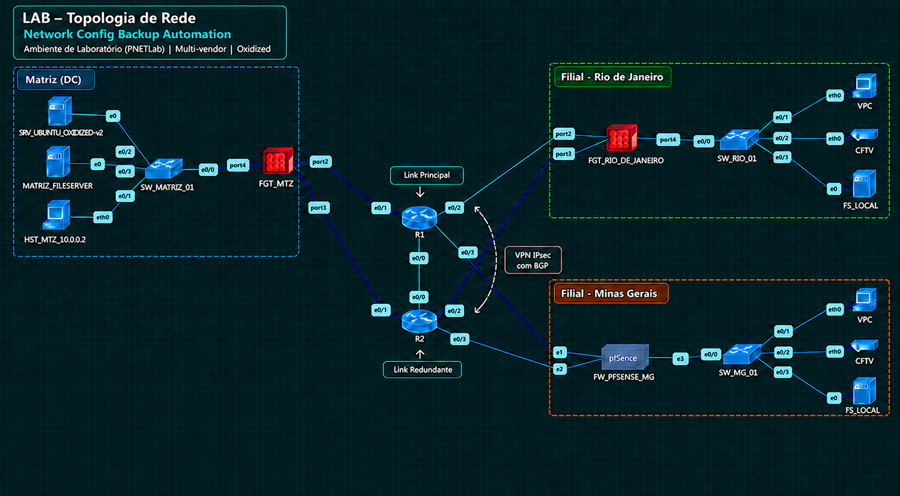
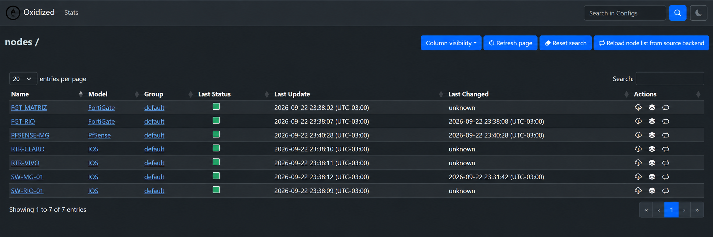

# Network Config Backup Automation

[](#resultados--results) [](#vendors-e-plataformas-validados--validated-vendors-and-platforms) [](https://github.com/ytti/oxidized)

> **PT-BR:** Projeto de laboratório para backup centralizado, versionamento, comparação e restauração de configurações de rede multi-vendor usando **Oxidized, Git e Linux**.  
> **EN:** Lab project for centralized multi-vendor network configuration backup, versioning, comparison and restore using **Oxidized, Git and Linux**.

## Visão geral | Overview

Este projeto foi construído em **PNETLab** para validar uma arquitetura centralizada de backup de configurações de rede, com histórico de versões em Git, interface Web, coleta automática e sob demanda, além de testes práticos de restauração.

This project was built in **PNETLab** to validate a centralized network configuration backup architecture with Git-based version history, Web UI, automatic and on-demand collection, and practical restore testing.

### Vendors e plataformas validados | Validated vendors and platforms

- **Fortinet FortiGate**
- **Cisco IOS** — switches e routers / switches and routers
- **pfSense**
- **Ubuntu Server 22.04.5 LTS**
- **Oxidized 0.37.0**
- **oxidized-web 0.18.1**
- **Git local**

A arquitetura é extensível a outros **firewalls, switches, routers e dispositivos de rede suportados pelo Oxidized**.

The architecture can be extended to other **firewalls, switches, routers and network devices supported by Oxidized**.

## Conteúdo do repositório | Repository contents

```text
.
├── README.md
├── docs/
│   ├── architecture.md
│   ├── troubleshooting.md
│   └── restore.md
├── models/
│   └── ios.rb
├── scripts/
│   ├── 01-install-oxidized.sh
│   ├── 02-configure-oxidized.sh
│   ├── 03-configure-oxidized-groups-files.sh
│   ├── 04-configure-oxidized-groups-git-and-files.sh
│   └── 05-install-ios-dr-model.sh
└── examples/
    ├── router.db.example
    ├── router.db.groups.example
    └── netplan-mtu.example.yaml
```

- [Quick Start](docs/quick-start.md)
- [Arquitetura validada / Validated architecture](docs/architecture.md)
- [Evidências de validação / Validation evidence](docs/evidence.md)
- [Troubleshooting do LAB / Lab troubleshooting](docs/troubleshooting.md)
- [Restore e recuperação / Restore workflow](docs/restore.md)
- [Modelo Cisco IOS DR-ready / DR-ready Cisco IOS model](models/ios.rb)
- [Script de instalação / Installation script](scripts/01-install-oxidized.sh)
- [Configuração por host + Git](scripts/02-configure-oxidized.sh)
- [Configuração por grupos + arquivos](scripts/03-configure-oxidized-groups-files.sh)
- [Configuração por grupos + Git + arquivos](scripts/04-configure-oxidized-groups-git-and-files.sh)
- [Instalação do modelo Cisco IOS DR-ready](scripts/05-install-ios-dr-model.sh)

Os scripts publicados foram preparados para portfólio e não contêm credenciais reais. O inventário e os exemplos de endereçamento são de laboratório/sanitizados.

The published scripts are portfolio-safe and contain no real credentials. Inventory and addressing examples are lab-only/sanitized.

## Modos de implantação | Deployment modes

Após executar `01-install-oxidized.sh`, o ambiente pode seguir diretamente para o modelo que atende à operação:

- `02-configure-oxidized.sh` — inventário por host com histórico em **Git**.
- `03-configure-oxidized-groups-files.sh` — inventário por **grupo/cliente** com arquivos atuais separados por pasta.
- `04-configure-oxidized-groups-git-and-files.sh` — inventário por **grupo/cliente**, histórico e diff em **Git** e cópia atual em arquivo para facilitar SCP/WinSCP.
- `05-install-ios-dr-model.sh` — instala o modelo Cisco IOS DR-ready validado no LAB, mantendo `ios` como model padrão dos nodes Cisco.

O script `04` é independente dos scripts `02` e `03`: o fluxo pode ser diretamente `01 -> 04`. Para ambientes com Cisco IOS, o fluxo recomendado passa a ser `01 -> 04 -> 05`.


## O que este projeto demonstra | What this project demonstrates

Para recrutadores e lideranças técnicas, este projeto demonstra experiência prática em:

- arquitetura de redes multi-site;
- segurança e administração de firewalls;
- troubleshooting de L2/L3, MTU/PMTU, SSH e serviços;
- Linux e systemd;
- automação com Shell;
- versionamento e rastreabilidade com Git;
- integração multi-vendor;
- desenho de processos de backup e recuperação;
- preocupação com segurança, escalabilidade e operação.

For recruiters and technical leaders, this project demonstrates hands-on experience with **multi-site networking, firewall administration, Linux, troubleshooting, automation, Git-based configuration versioning, multi-vendor integration, and restore workflows**.

## Objetivos | Goals

- Centralizar backups de configurações de rede.
- Manter histórico e rastreabilidade por Git.
- Comparar alterações entre versões.
- Permitir coleta automática e manual.
- Suportar diferentes vendors e protocolos por equipamento.
- Validar procedimentos reais de restauração.
- Criar uma base simples para futura automação, retenção e integração com storage externo.

## Arquitetura visual | Visual architecture



A topologia acima foi redesenhada a partir do ambiente real do **PNETLab**, preservando o desenho técnico do LAB e destacando os pontos principais: comunicação entre Matriz e filiais via **VPN IPsec**, redundância de links **CLARO/VIVO** e **roteamento dinâmico BGP** para failover entre caminhos.

## Evidência real — Oxidized Web UI | Real evidence

A interface Web do Oxidized foi validada com **7 nodes** no LAB, incluindo FortiGate, pfSense e Cisco IOS.



A captura acima representa o ambiente real do laboratório. O indicador de status do FGT-MATRIZ foi ajustado visualmente para verde nesta evidência, conforme autorização do autor do LAB.

## Arquitetura validada | Validated architecture

```text
Network Devices
   |
   |-- SSH / Telnet (lab legacy images)
   v
Ubuntu Server + Oxidized
   |
   |-- Git local
   |-- Web UI :8888
   |-- Automatic collection
   |-- On-demand collection
   |-- Version history / Diff
   `-- Restore workflow
```

O ambiente final do LAB possui **7 nodes** gerenciados pelo Oxidized em uma topologia multi-site:

| Node role | Vendor / Model | Input |
|---|---|---|
| Firewall - Matriz | FortiGate | SSH |
| Firewall - Rio | FortiGate | SSH |
| Firewall - MG | pfSense | SSH |
| Switch - Rio | Cisco IOS | Telnet* |
| Switch - MG | Cisco IOS | Telnet* |
| Router - Claro | Cisco IOS | Telnet* |
| Router - Vivo | Cisco IOS | Telnet* |

* Telnet foi utilizado somente por limitação das imagens Cisco IOL antigas disponíveis no PNETLab. Em produção, o padrão recomendado é **SSH**.

## Estrutura do Oxidized

Principais caminhos utilizados no servidor:

```text
/home/oxidized/.config/oxidized/
├── config
├── router.db
└── oxidized.git
```

- `config`: configuração principal do Oxidized.
- `router.db`: inventário dos equipamentos.
- `oxidized.git`: repositório Git bare com configurações e histórico de versões.

Exemplo do inventário multi-vendor:

```text
DEVICE-NAME:MANAGEMENT-IP:model:input
```

Exemplos de modelos usados no LAB:

```text
fortigate:ssh
pfsense:ssh
ios:telnet
```

## Coleta e versionamento | Collection and versioning

A periodicidade é controlada pelo parâmetro `interval`:

```yaml
interval: 86400
```

No LAB, isso representa uma coleta a cada **24 horas**.

O Git local permite:

- histórico de versões;
- diff entre coletas;
- recuperação de uma versão específica;
- auditoria de alterações;
- exportação da configuração atual via CLI.

Exemplo:

```bash
sudo -u oxidized git \
  --git-dir=/home/oxidized/.config/oxidized/oxidized.git \
  ls-tree -r --name-only HEAD
```

## Interface Web

A interface Web do Oxidized foi validada para:

- visualizar nodes;
- consultar status;
- executar coleta manual;
- consultar histórico;
- comparar versões;
- abrir a configuração coletada no navegador.

Porta utilizada no LAB:

```text
TCP/8888
```

> Em produção, a publicação da interface deve ser protegida por controles corporativos adequados, preferencialmente HTTPS e controle de acesso.

## Restore validado | Validated restore

### Observação importante sobre FortiGate

Durante a evolução do LAB foi identificado que a configuração coletada pelo Oxidized é limitada pela visibilidade do usuário administrativo utilizado na coleta. No teste com uma conta restrita, `show system admin` exibiu somente a própria conta de coleta, omitindo administradores com privilégios superiores.

Por isso, uma coleta bem-sucedida no FortiGate **não deve ser tratada automaticamente como backup completo para disaster recovery** sem validar o perfil administrativo e executar teste de restore. No LAB seguinte, a conta dedicada `oxidized_backup` será testada como `super_admin` com restrição por trusted host.

No script `04`, o modelo FortiGate utiliza `fullconfig: true`, mas a visibilidade continua dependendo das permissões da conta.

### FortiGate

O conteúdo coletado pelo Oxidized foi exportado para `.conf`, ajustado para manter apenas o cabeçalho compatível com o FortiOS e utilizado com sucesso em um teste de restauração no ambiente de laboratório.

### Cisco IOS

Foi realizado um teste destrutivo de recuperação do `SW_RIO_01` a partir de um equipamento zerado. O modelo IOS do projeto foi estendido para transformar a VLAN database em comandos restauráveis e preservar o estado administrativo das SVIs ativas.

O restore recuperou VLANs, portas access, trunk 802.1Q, SVI de gerenciamento, estado `up/up`, convergência de STP e conectividade com o gateway. O modelo validado está em [`models/ios.rb`](models/ios.rb).

### pfSense

A configuração coletada pelo Oxidized foi apresentada em **XML** pela interface Web.

Procedimento validado:

1. Abrir a versão desejada na Web UI do Oxidized.
2. Usar **Ctrl + S** no navegador.
3. Salvar o arquivo com extensão `.xml`.
4. Utilizar o XML no processo de restore do pfSense.

Após o restore, o pfSense carregou a configuração e iniciou a reinstalação dos packages em segundo plano.

## Troubleshooting relevante | Key troubleshooting

### MTU no PNETLab

Durante o LAB, sessões SSH para FortiGate conectavam, mas comandos extensos podiam expirar. Testes de PMTU mostraram um limite efetivo inferior ao MTU padrão do Ubuntu.

Workaround validado no ambiente virtual:

```yaml
network:
  version: 2
  renderer: networkd
  ethernets:
    eth0:
      dhcp4: yes
      mtu: 1496
```

Após tornar o MTU **1496** persistente via Netplan e reiniciar o servidor:

- o MTU permaneceu após reboot;
- o serviço Oxidized iniciou automaticamente;
- as coletas voltaram a funcionar.

> Esse ajuste é específico do cenário PNETLab testado e não deve ser tratado como requisito padrão de produção.

### Cisco IOL legado

Algumas imagens IOL do LAB não ofereciam suporte SSH adequado ou exigiam algoritmos criptográficos legados. Para não enfraquecer a configuração SSH do servidor Ubuntu, Telnet foi utilizado apenas nesses nodes de laboratório.

## Resultados | Results

- ✅ Servidor Oxidized operacional após reboot.
- ✅ Git local validado.
- ✅ Web UI validada.
- ✅ Coleta automática validada.
- ✅ Coleta sob demanda validada.
- ✅ Histórico e diff validados.
- ✅ 7 nodes em ambiente multi-site.
- ✅ FortiGate, Cisco IOS e pfSense integrados.
- ✅ SSH e input por node validados.
- ⚠️ Restore de FortiGate validado no cenário testado; validação adicional de completude está pendente após a descoberta sobre permissões da conta de coleta.
- ✅ Restore de Cisco IOS validado após perda total do switch, incluindo VLAN database e estado de SVI.
- ✅ Restore de pfSense via XML validado.
- ✅ Persistência do MTU do LAB validada.

## Próximas evoluções | Next steps

- Portal Web simplificado para cadastro de novos hosts.
- File Server / NAS para cópias adicionais.
- Política de retenção para ambientes de maior escala.
- Export automático de configurações prontas para restore.
- HTTPS para a Web UI.
- Validar coleta FortiGate com conta dedicada `super_admin` restrita por trusted host.
- Automatizar backup nativo do FortiGate diretamente para servidor via **SFTP**.
- Validar restore em outros vendors antes de considerar o backup completo.
- Inclusão de outros vendors suportados pelo Oxidized.
- Monitoramento de falhas de coleta e capacidade de disco.

## Segurança | Security

Este repositório de portfólio não contém:

- senhas;
- PSKs;
- certificados privados;
- hashes reutilizáveis;
- configurações completas de clientes;
- endereços públicos reais;
- segredos de produção.

Os exemplos são de laboratório e/ou foram sanitizados antes da publicação.

## Créditos e projeto de terceiros | Credits and third-party project

Este projeto utiliza o [Oxidized](https://github.com/ytti/oxidized), uma ferramenta open source para backup e versionamento de configurações de dispositivos de rede.

Oxidized é mantido por seus respectivos contribuidores e distribuído sob a **Apache License 2.0**.

This project uses [Oxidized](https://github.com/ytti/oxidized), an open-source tool for network device configuration backup and versioning.

Oxidized is maintained by its respective contributors and distributed under the **Apache License 2.0**.

Este repositório **não é afiliado ao projeto oficial do Oxidized**. O conteúdo representa uma implementação de laboratório, documentação, automações, troubleshooting e arquitetura desenvolvidos para estudo e demonstração técnica.

This repository **is not affiliated with the official Oxidized project**. Its content represents a lab implementation, documentation, automation, troubleshooting and architecture developed for study and technical demonstration purposes.

## Autor

**Ronan Braga**

Projeto de portfólio técnico focado em **Network Security, Network Automation, Linux, Fortinet, Cisco, pfSense, Git e troubleshooting**.
