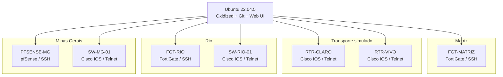

# Arquitetura do LAB | Lab Architecture


> Diagrama técnico derivado da topologia real do PNETLab. O desenho destaca VPN IPsec redundante entre sites e roteamento dinâmico BGP para failover.

## Objetivo

Validar uma solução centralizada de backup e versionamento de configurações de rede em ambiente **multi-site** e **multi-vendor**, utilizando Oxidized, Git local e interface Web.

## Topologia lógica



## Inventário validado

| Node | Plataforma | Função | Input |
|---|---|---|---|
| FGT-MATRIZ | Fortinet FortiGate | Firewall da matriz | SSH |
| FGT-RIO | Fortinet FortiGate | Firewall da filial Rio | SSH |
| PFSENSE-MG | pfSense | Firewall da filial MG | SSH |
| SW-RIO-01 | Cisco IOS | Switch L2 | Telnet* |
| SW-MG-01 | Cisco IOS | Switch L2 | Telnet* |
| RTR-CLARO | Cisco IOS | Router de transporte simulado | Telnet* |
| RTR-VIVO | Cisco IOS | Router de transporte simulado | Telnet* |

\* Telnet foi utilizado apenas por limitação das imagens Cisco IOL antigas do PNETLab. Em produção, o padrão recomendado é SSH.

## Segmentação de rede do LAB

Padrão adotado:

```text
10.<site>.<vlan>.<host>
```

- VLAN 10 — USERS
- VLAN 20 — MONITORAMENTO
- VLAN 30 — SERVIDORES
- Matriz — site octet 0
- Rio — site octet 10
- Minas — site octet 20

O servidor Oxidized está posicionado na rede de monitoramento da Matriz e alcança os equipamentos remotos por roteamento entre sites.

## Componentes

- Ubuntu Server 22.04.5 LTS
- Ruby 3.x
- Oxidized 0.37.0
- oxidized-web 0.18.1
- Git local
- systemd
- PNETLab

## Fluxo de coleta

O LAB passou a validar dois tipos de saída operacional por grupo:

```text
Dispositivo
   |
   | SSH / Telnet
   v
Oxidized
   |
   +--> Git por grupo
   |      `-- histórico / diff
   |
   +--> arquivo atual por grupo
   |      `-- SCP / WinSCP / File Server
   |
   `--> Web UI
          `-- status / consulta / coleta manual
```

O script `04-configure-oxidized-groups-git-and-files.sh` implementa esse modelo e pode ser executado diretamente após o `01-install-oxidized.sh`.

## Estrutura de inventário

O LAB evoluiu para permitir protocolo e grupo por node:

```text
NAME:IP:MODEL:INPUT:GROUP
```

Exemplos sanitizados:

```text
FGT-SITE-A:10.0.20.1:fortigate:ssh
PFSENSE-SITE-B:10.20.20.1:pfsense:ssh
SW-SITE-B:10.20.20.10:ios:telnet
```

## Armazenamento

No modo com grupos + Git + Files, a estrutura validada é:

```text
/home/oxidized/.config/oxidized/
├── git-repos/
│   ├── GRP_MATRIZ.git
│   ├── GRP_RIO.git
│   ├── GRP_MINAS.git
│   └── GRP_OPERADORAS.git
└── configs/
    ├── GRP_MATRIZ/
    ├── GRP_RIO/
    ├── GRP_MINAS/
    └── GRP_OPERADORAS/
```

Os repositórios Git guardam histórico e diff; as pastas `configs` mantêm a cópia atual para operação via SCP/WinSCP.

## Escalabilidade

Para um cenário produtivo com centenas de equipamentos, a arquitetura deve incluir:

- política de retenção;
- monitoramento de capacidade;
- SSD/storage adequado;
- limite de concorrência;
- cópia adicional em NAS/File Server;
- estratégia para histórico de longo prazo;
- proteção da Web UI;
- gestão segura de credenciais.

Este LAB valida a arquitetura e o fluxo operacional. Dimensionamento de produção deve considerar volume, frequência de coleta e tamanho médio das configurações.


## Consideração de backup por vendor

A possibilidade de coletar uma configuração não garante, por si só, que o arquivo contenha tudo o que é necessário para disaster recovery.

No FortiGate, o LAB identificou que a visibilidade da configuração depende do perfil administrativo da conta usada pelo Oxidized. Uma conta restrita não apresentou todos os administradores em `show system admin`.

O pfSense teve backup e restore validados no cenário testado. Outros vendors devem passar por validação própria de restore antes de uso produtivo.

A próxima etapa do estudo FortiGate será comparar a coleta do Oxidized com o mecanismo nativo de backup automatizado para servidor SFTP.
